# Contributing to Zizou & Architecture Guide

Welcome! This guide is for developers who want to understand the inner workings of Zizou, run the codebase locally, write tests, or contribute to its development.

---

## Developer Setup

Ensure you have [Bun](https://bun.sh) installed. Zizou uses Bun for package management and script execution.

```bash
# 1. Clone the repository
git clone https://github.com/arnvG17/zizou.git
cd zizou

# 2. Install dependencies
bun install

# 3. Run the CLI in development mode
bun run src/cli.tsx

# 4. Run TypeScript typechecking
bun run typecheck

# 5. Build the project
bun run build
```

---

## File Structure & Layering

The codebase strictly adheres to a layered architecture. Higher layers may import from lower layers, but never vice-versa (e.g. `tools` should never import from `ui` or `agent`).

```
src/
├── ui/           # React/Ink terminal interface (Rendering & Input)
├── agent/        # Agent Loop, Orchestration, Executor & Verifier
├── checkpoint/   # Version control & checkpointing engine
├── provider/     # Provider instantiation and API Key injections
├── tools/        # Native filesystem and command execution tools
└── config/       # Base layer for configuration and persistent settings
```

### Layer Breakdown

1. **`ui/`** (`App.tsx`, `Chat.tsx`, `ApiKeySetup.tsx`)
   - The React/Ink terminal interface. Responsible *only* for rendering state and handling user input.
2. **`agent/`** (`orchestrator.ts`, `run-turn.ts`, `executor.ts`, `verifier.ts`)
   - The core AI loop. Uses `streamText` to communicate with the model, executes tools via the executor, verifies changes using the verifier, and yields incremental events back to the UI.
3. **`checkpoint/`** (`manager.ts`, `patcher.ts`, `storage.ts`, `types.ts`)
   - The custom version-control engine that handles creating branches, creating checkpoints with file-level diff patches, restoring points, and reverting files.
4. **`provider/`** (`resolve-model.ts`)
   - Responsible for instantiating the correct `LanguageModel` via `@ai-sdk/anthropic`, `@ai-sdk/openai`, etc., dynamically injecting API keys.
5. **`tools/`** (`read-file.ts`, `edit-file.ts`, `run-bash.ts`, etc.)
   - Pure functions that define the capabilities of the agent. They return deterministic JSON payloads (never throwing errors). `runBash` strictly relies on an injected `ConfirmFn` callback to ask the user for permission.
6. **`config/`** (`api-keys.ts`)
   - The base layer handling persistent local storage using `conf`.

---

## Architecture Deep Dive: The Agent Loop

The core architecture of Zizou is built around real-time streaming, automatic tool execution, and pre-execution state tracking.

### High-Level Flow Diagram

```mermaid
sequenceDiagram
    participant UI as Chat UI (React/Ink)
    participant Agent as runTurn (Agent Loop)
    participant Provider as resolveModel (Config)
    participant SDK as streamText (AI SDK)
    participant LLM as Provider API (Groq/Anthropic)
    
    UI->>Agent: Hit Enter (User Message)
    Agent->>Provider: resolveModel(providerChoice)
    Provider-->>Agent: Returns configured LanguageModel (API Key injected)
    Agent->>SDK: streamText({ model, tools, messages })
    
    rect rgb(30, 30, 30)
        Note right of SDK: Automatic Streaming & Tool Loop
        SDK->>LLM: HTTP Request (System Prompt, History, Tool Schemas)
        LLM-->>SDK: Streams Text Chunks
        SDK-->>Agent: Yields text-delta events
        Agent-->>UI: Updates screen token-by-token
        
        LLM-->>SDK: Streams Tool Call JSON (e.g. writeFile)
        Note over SDK,Agent: Executor intercepts tool-call & captures pre-execution file state
        SDK->>SDK: Pauses stream, validates JSON schema
        SDK->>SDK: Runs local execute() function for the tool
        SDK->>LLM: HTTP Request with Tool Result
    end
    
    SDK-->>Agent: fullStream finishes
    Agent-->>UI: turn-complete
```



### 1. Model Configuration (`resolveModel`)
Before any chatting begins, the system must set up the connection to the requested AI provider (e.g., Groq, Anthropic, or a local Ollama instance). This happens in `src/provider/resolve-model.ts`.

It fetches the API key from local storage, instantiates the Vercel AI SDK provider factory (like `createGroq`), and returns a ready-to-use `LanguageModel`.

```typescript
// src/provider/resolve-model.ts
export function resolveModel(provider: ProviderChoice): LanguageModel {
  if (provider === "groq") {
    const apiKey = getApiKey("groq");
    if (!apiKey) throw new Error("No API key for Groq.");
    const groq = createGroq({ apiKey });
    return groq(getActiveModelId("groq")); 
  }
  // ... handles other providers
}
```

### 2. Why Streaming?
When an LLM writes code, the response can be thousands of tokens long. If we waited for the entire HTTP request to finish, the user would stare at a frozen terminal for 20-30 seconds.

**Streaming** solves this. The API sends the response back chunk-by-chunk (sometimes word-by-word) as it's being generated on the server. The `streamText` function reads this stream in real time.

### 3. The `streamText` Engine & Tool Execution
The [streamText](file:///c:/Users/Arnv/ZIZOUv1/src/agent/run-turn.ts#L262) function (from the Vercel AI SDK `ai` package) is the entry point that actually executes the network request to the LLM. 

This call takes place in [src/agent/run-turn.ts](file:///c:/Users/Arnv/ZIZOUv1/src/agent/run-turn.ts) inside the [runTurn](file:///c:/Users/Arnv/ZIZOUv1/src/agent/run-turn.ts#L217) function, passing the compiled prompt, registered tools, and optimized conversation history:

```typescript
const result = streamText({
  model,                  // Ready-to-use LanguageModel instance from resolveModel()
  system: systemPrompt,   // Injected System Prompt (base instructions, OS context, pinned files, repo map)
  tools,                  // Map of Zizou tools (readFile, writeFile, runBash, etc.)
  messages: history,      // Conversation history array, with the latest user query pre-appended
  stopWhen: stepCountIs(maxSteps), // Safety cap to prevent run-away agent loops (default: 15)
  maxRetries: 0,          // Disabled so rate limits (429) surface immediately to save tokens
  ...(providerOptions ? { providerOptions } : {}), // e.g. parallelToolCalls: false for OpenAI
});
```

Here is where each piece of the payload comes from:
- **System Prompt (`system`)**: Compiled dynamically via [buildSystemPrompt](file:///c:/Users/Arnv/ZIZOUv1/src/context/build-system-prompt.ts#L139) in [src/context/build-system-prompt.ts](file:///c:/Users/Arnv/ZIZOUv1/src/context/build-system-prompt.ts) to provide the model with agent instructions, ambient OS/workspace context, pinned files, and the role-aware repo map.
- **Tools (`tools`)**: Configured and registered dynamically based on the current mode (disabled during casual conversations).
- **User Query & History (`messages`)**: The orchestrator or executor packages the latest user request (or step-specific instruction) and appends it to the running history array before calling [runTurn](file:///c:/Users/Arnv/ZIZOUv1/src/agent/run-turn.ts#L217).

When the LLM decides it needs to use a tool, it stops generating plain text and outputs a structured tool-call payload (which is intercepted and executed locally by the SDK, sending the result back to the model in the next round-trip, up to a maximum of 15 steps).

### 4. The Interception Loop (`runTurn` & `executeStep`)
While `streamText` is handling the network and executing tools, the terminal UI needs to know what is happening so it can draw text or display loading badges. 

This is the job of `runTurn`. It acts as a wrapper around `streamText`, iterating over the `result.fullStream` in real-time, translating the raw AI SDK stream parts into clean `AgentEvent` objects for the React UI.

Furthermore, `executeStep` in `src/agent/executor.ts` wraps the `runTurn` loop. When a `tool-call` for a file modification (such as `writeFile` or `editFile`) is received, it intercepts it **before** execution to capture the file's current content as `oldFileStates`. This is crucial for Zizou's independent version-control and diffing engine.

---

## Testing & Verification (Eval Harness)

Zizou includes a programmatic, deterministic evaluation harness to test code changes against a suite of "golden tasks" with zero manual inspection.

Every task runs against a fresh, isolated temporary workspace under `evals/temp-workspaces/` to prevent polluting the main repository directory.

### Running the Evals

You can run the eval suite using Bun:

```bash
# Run the entire suite of golden tasks
bun run eval

# Run a specific task by ID
bun run eval -- --task build-single-file-fix

# Run evals using a specific LLM provider
bun run eval -- --provider groq
```

### Adding New Evals

1. Create a new task definition in `evals/golden-tasks/` exporting a `GoldenTask` object.
2. Implement a deterministic `expectedCheck` (e.g. checking file existence, file content regex, or bash success).
3. Import and add the task to the `ALL_TASKS` array in `evals/golden-tasks/index.ts`.

For more details on what the tests check and how they are implemented, see the [EVAL.md](file:///c:/Users/Arnv/ZIZOUv1/specs/EVAL.md) spec.
