# Zizou - AI Coding Agent CLI (Phase 1)

Zizou is an open-source AI coding agent CLI tool built with TypeScript, React (Ink), and the Vercel AI SDK. It allows you to chat with Claude 3.5 Sonnet or GPT-4o directly in your terminal, and grants the AI the ability to read files, edit files (safely), and run sandboxed terminal commands with your explicit approval.

## Installation

Ensure you have [Bun](https://bun.sh) installed.

```bash
# Clone the repository
git clone https://github.com/arnvG17/zizou.git
cd zizou

# Install dependencies
bun install
```

## Running Zizou

You can run Zizou directly using Bun:
```bash
bun run src/cli.tsx
```
*(On first run, the CLI will present a setup screen asking you to select a provider and input an API key).*

## Core Features & Slash Commands

Zizou comes with several built-in slash commands you can use in the chat bar to configure your agent on the fly:

- **/keys**: Opens an interactive setup screen allowing you to switch AI providers (e.g., from Groq to Anthropic) and enter or update your API keys.
- **/models**: Allows you to override the default model for a given provider (e.g., switching from `claude-3-5-sonnet-20240620` to an older or newer model).
- **/context**: Displays a panel showing you exactly what files the AI currently has in its context window, helping you manage context bloat.

## LLM Compatibility & Connection

Zizou (Phase 1) is built on top of the Vercel AI SDK, meaning it is provider-agnostic. Out of the box, it supports:

- **Anthropic**: High-quality reasoning (Claude 3.5 Sonnet). Requires an API key.
- **OpenAI**: GPT-4o capabilities. Requires an API key.
- **Groq**: Extremely fast inference for Llama 3 models. Requires an API key.
- **Google**: Gemini capabilities. Requires an API key.
- **OpenRouter**: Access to a massive ecosystem of models through a single API key.
- **Ollama**: 100% free, local execution. Ollama exposes an OpenAI-compatible API on `http://localhost:11434/v1`. By selecting Ollama, you can run models like `llama3` locally without needing a real API key.

To connect to any of these, simply run `/keys` inside the CLI or provide an environment variable (e.g., `export ANTHROPIC_API_KEY="..."`).

## File Structure & Layering

The codebase strictly adheres to a layered architecture. Higher layers may import from lower layers, but never vice-versa:

1. **`ui/`** (`App.tsx`, `Chat.tsx`, `ApiKeySetup.tsx`)
   - The React/Ink terminal interface. Responsible *only* for rendering state and handling user input.
2. **`agent/`** (`run-turn.ts`)
   - The core AI loop. Uses `streamText` to communicate with the model, execute tools, and yield incremental events (text deltas, tool calls) back to the UI.
3. **`provider/`** (`resolve-model.ts`)
   - Responsible for instantiating the correct `LanguageModel` via `@ai-sdk/anthropic` or `@ai-sdk/openai`, dynamically injecting API keys.
4. **`tools/`** (`read-file.ts`, `edit-file.ts`, `run-bash.ts`, etc.)
   - Pure functions that define the capabilities of the agent. They return deterministic JSON payloads (never throwing errors). `runBash` strictly relies on an injected `ConfirmFn` callback to ask the user for permission.
5. **`config/`** (`api-keys.ts`)
   - The base layer handling persistent local storage using `conf`.

## Security & API Key Storage

**🚨 IMPORTANT:** API keys entered via the initial setup screen are stored in **plain text** within a JSON file in your OS's default configuration directory (e.g., `~/.config/zizou/config.json`). They are **NOT encrypted**.

To avoid writing your key to disk entirely, you can provide it via environment variables instead, which will always take precedence:
```bash
export ANTHROPIC_API_KEY="sk-ant-..."
# or
export OPENAI_API_KEY="sk-proj-..."
```

## Known Limitations (Future Work)
- **No File Indexing:** Zizou currently cannot index or search across the entire repository (no tree-sitter integration).
- **No Session Persistence:** Chat history is lost when you exit the CLI.
- **No Keychain Storage:** API keys are stored in unencrypted plain text.
- **No Cost Tracking:** Token usage and cost tracking are not yet displayed in the UI.

## Architecture Deep Dive: The Agent Loop

The core architecture of Zizou is built around real-time streaming and automatic tool execution. Here is a detailed breakdown of how the UI communicates with the LLM through `runTurn` and `streamText`.

### High-Level Flow Diagram

```mermaid
sequenceDiagram
    participant UI as Chat UI (React/Ink)
    participant Agent as runTurn (Agent Loop)
    participant Provider as resolveModel (Config)
    participant SDK as streamText (AI SDK)
    participant LLM as Provider API (Groq/Anthropic)
    
    UI->>Agent: Hit Enter (User Message)
    Agent->>Provider: resolveModel(providerChoice)
    Provider-->>Agent: Returns configured LanguageModel (API Key injected)
    Agent->>SDK: streamText({ model, tools, messages })
    
    rect rgb(30, 30, 30)
        Note right of SDK: Automatic Streaming & Tool Loop
        SDK->>LLM: HTTP Request (System Prompt, History, Tool Schemas)
        LLM-->>SDK: Streams Text Chunks
        SDK-->>Agent: Yields text-delta events
        Agent-->>UI: Updates screen token-by-token
        
        LLM-->>SDK: Streams Tool Call JSON (e.g. readFile)
        SDK->>SDK: Pauses stream, validates JSON schema
        SDK->>SDK: Runs local execute() function for the tool
        SDK->>LLM: HTTP Request with Tool Result
    end
    
    SDK-->>Agent: fullStream finishes
    Agent-->>UI: turn-complete
```



### 1. Model Configuration (`resolveModel`)
Before any chatting begins, the system must set up the connection to the requested AI provider (e.g., Groq, Anthropic, or a local Ollama instance). This happens in `src/provider/resolve-model.ts`.

It fetches the API key from local storage, instantiates the Vercel AI SDK provider factory (like `createGroq`), and returns a ready-to-use `LanguageModel`.

```typescript
// src/provider/resolve-model.ts
export function resolveModel(provider: ProviderChoice): LanguageModel {
  if (provider === "groq") {
    const apiKey = getApiKey("groq");
    if (!apiKey) throw new Error("No API key for Groq.");
    const groq = createGroq({ apiKey });
    // Returns the active Groq model (e.g., llama3-70b-8192)
    return groq(getActiveModelId("groq")); 
  }
  // ... handles other providers (anthropic, openai, ollama)
}
```

### 2. Why Streaming?
When an LLM writes code, the response can be thousands of tokens long. If we waited for the entire HTTP request to finish, the user would stare at a frozen terminal for 20-30 seconds.

**Streaming** solves this. The API sends the response back chunk-by-chunk (sometimes word-by-word) as it's being generated on the server. The `streamText` function reads this stream in real time.

### 3. The `streamText` Engine & Tool Execution
The `streamText` function (from the `ai` package) is the heavy lifter. You give it the model, the conversation history, and an object containing all available tools.

```typescript
const tools = { readFile, writeFile, runBash }; 
const result = streamText({ model, tools, messages });
```

When the LLM decides it needs to use a tool, it stops generating plain text and outputs a hidden JSON payload like `{"tool": "readFile", "arguments": {"path": "main.ts"}}`.
`streamText` manages the entire execution lifecycle automatically:
1. It intercepts the JSON payload.
2. It validates the arguments against the Zod `inputSchema`.
3. It literally calls the JavaScript `execute` function for `readFile`.
4. It packages the file contents into a "tool result" message and sends a *second* network request back to the LLM to continue the thought process.

### 4. The Interception Loop (`runTurn`)
While `streamText` is handling the network and executing tools, the terminal UI needs to know what is happening so it can draw text or display loading badges. 

This is the job of `runTurn`. It acts as a wrapper around `streamText`, iterating over the `result.fullStream` in real-time, translating the raw AI SDK stream parts into clean `AgentEvent` objects for the React UI.

```typescript
// Inside src/agent/run-turn.ts
for await (const part of result.fullStream) {
  if (part.type === "text-delta") {
    // LLM spoke a word. Yield it immediately to the UI so it appears on screen.
    yield { kind: "text-delta", text: part.text };
  } 
  else if (part.type === "tool-call") {
    // LLM requested a tool. `streamText` is currently running it in the background.
    // Yield this so the UI can draw a spinning loading badge.
    yield { kind: "tool-call", toolName: part.toolName };
  }
}
```
