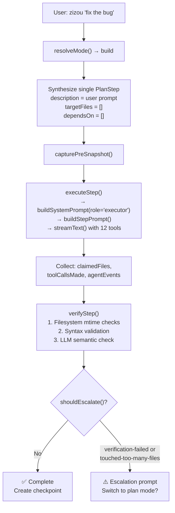
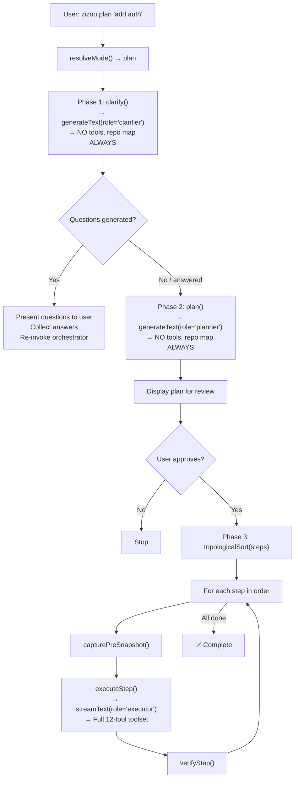

# Zizou Modes, Tools & Context — Deep Dive

> [!CAUTION]
> **SUPERSEDED — kept for history. Do not treat this as current.**
>
> See [008-auto-mode-and-routing.md](./008-auto-mode-and-routing.md) instead.
>
> The following are described here and no longer exist:
> - **Two modes (build/plan).** There are now five pinned modes and four
>   executable routes, with `auto` as the default.
> - **No upfront LLM classification.** That is exactly what auto mode does
>   now — see 008 for how the original cost objection is answered.
> - **Three context budgets** (`/context light|default|max`) and the repo map
>   they gated. Both removed; roles discover the codebase with glob/grep.
> - **Three reasoning levels** (`/reasoning`, `/expert`). Replaced by the
>   single `/effort` dial.
> - **The clarifier stage.** The planner states assumptions instead, and the
>   plan gate is the clarification.
> - **Build → plan escalation.** Removed; routing is decided once, up front.

This document explains exactly how Zizou's different operating modes and reasoning levels handle tools, context injection, system prompts, and LLM interactions. Every claim links back to the actual source code.

---

## Table of Contents

1. [The Two Operating Modes: Build vs Plan](#the-two-operating-modes)
2. [The Three Context Budgets: Light / Default / Max](#the-three-context-budgets)
3. [The Three Reasoning Levels: Low / Medium / High](#the-three-reasoning-levels)
4. [Agent Roles & Their Capabilities](#agent-roles--their-capabilities)
5. [Tool Availability Per Role](#tool-availability-per-role)
6. [System Prompt Construction](#system-prompt-construction)
7. [How an LLM Call Actually Looks](#how-an-llm-call-actually-looks)
8. [End-to-End Flow Diagrams](#end-to-end-flow-diagrams)
9. [Escalation: Build → Plan](#escalation-build--plan)

---

## The Two Operating Modes

Defined in [mode.ts](file:///c:/Users/Arnv/ZIZOUv1/src/agent/mode.ts):

| Aspect | **Build Mode** (default) | **Plan Mode** (`--plan`) |
|---|---|---|
| **Trigger** | `zizou "<prompt>"` | `zizou plan "<prompt>"` or `--plan` |
| **Pipeline** | Prompt → single synthetic step → execute → verify | Prompt → clarify → plan → confirm → execute each step → verify each |
| **LLM Calls** | 1 executor call + 1 verifier call | 1 clarifier + 1 planner + N executor + N verifier |
| **Tools Available** | Full toolset (readFile, writeFile, runBash…) | **Clarifier/Planner: NONE.** Executor: Full toolset |
| **Escalation** | Yes — can escalate to Plan mode | No — already in plan mode |
| **User Gates** | None (direct execution) | 2 gates: clarification answers + plan Y/n approval |

> [!IMPORTANT]
> Mode is chosen **deterministically** from the CLI flag — there is NO upfront LLM classification call. This is an explicit design decision documented in [mode.ts L18-L28](file:///c:/Users/Arnv/ZIZOUv1/src/agent/mode.ts#L18-L28).

### Mode Resolution

```typescript
// mode.ts — Pure function, no LLM, no heuristics
export function resolveMode(args: { planFlag: boolean }): ModeContext {
  return {
    mode: args.planFlag ? "plan" : "build",
    reason: "user-flag",
  };
}
```

---

## The Three Context Budgets

Defined in [types.ts](file:///c:/Users/Arnv/ZIZOUv1/src/agent/types.ts#L161):

```typescript
budget: "light" | "default" | "max"
```

The budget controls **how much context** is injected into the system prompt — specifically whether the **repo map** (the pre-computed file/symbol index) is included.

### Repo Map Inclusion Logic

From [build-system-prompt.ts](file:///c:/Users/Arnv/ZIZOUv1/src/context/build-system-prompt.ts#L113-L133):

| Role | `light` budget | `default` budget | `max` budget |
|---|---|---|---|
| **Clarifier** | ✅ Always included | ✅ Included | ✅ Included |
| **Planner** | ✅ Always included | ✅ Included | ✅ Included |
| **Executor** (with targetFiles) | ❌ Excluded | ✅ Included | ✅ Included |
| **Executor** (empty targetFiles) | ❌ Excluded | ❌ Excluded | ❌ Excluded |

> [!NOTE]
> The clarifier and planner **always** get the repo map regardless of budget. Stripping it from the planner caused a "write-before-scaffold" ordering bug — the planner couldn't see which files already existed.

### What the Repo Map Contains

Built by [repo-map.ts](file:///c:/Users/Arnv/ZIZOUv1/src/context/repo-map.ts) — a "Level 1" context summary:

- File paths relative to workspace root
- Top-level symbol declarations (functions, classes, interfaces, types)
- Line numbers for each symbol
- **NOT** file contents — only names and signatures (truncated to 120 chars)

Example output:
```
src/agent/orchestrator.ts:
  L139: function shouldEscalate(
  L174: function topologicalSort(steps: PlanStep[]): PlanStep[]
  L222: async function* runBuildMode(
  L339: async function* runPlanMode(
  L533: export async function* runOrchestrator(
```

---

## The Three Reasoning Levels

Defined in [ai-config.ts](file:///c:/Users/Arnv/ZIZOUv1/src/config/ai-config.ts#L24):

```typescript
export type ReasoningLevel = "low" | "medium" | "high";
```

Reasoning levels are part of the **preset system** — they select different models and parameters:

### How Presets Map to Models

From [ai-config.ts L49-L86](file:///c:/Users/Arnv/ZIZOUv1/src/config/ai-config.ts#L49-L86):

| Preset | Reasoning | OpenAI Model | Anthropic Model | Google Model |
|---|---|---|---|---|
| `fast` | `low` | gpt-5-mini | claude-haiku-4-5 | gemini-2.0-flash |
| `balanced` | `medium` | gpt-5-mini | claude-sonnet-4-5 | gemini-2.5-flash |
| `high` | `high` | gpt-5 | claude-opus-4-5 | gemini-2.5-pro |
| `testing` | `low` | gpt-5-mini | claude-haiku-4-5 | gemini-2.0-flash |

### How Presets Map to Parameters

From [ai-config.ts L92-L97](file:///c:/Users/Arnv/ZIZOUv1/src/config/ai-config.ts#L92-L97):

| Preset | Temperature | Max Output Tokens |
|---|---|---|
| `fast` | 0.2 | 1,024 |
| `balanced` | 0.2 | 2,048 |
| `high` | 0.1 | 4,096 |
| `testing` | 0.0 | 512 |

> [!TIP]
> The `high` preset uses a **lower** temperature (0.1) than `balanced` (0.2) — more deterministic, but with a **4× larger** output window for complex multi-file code generation.

---

## Agent Roles & Their Capabilities

There are three agent roles, each with fundamentally different capabilities:

### 1. Clarifier — "Ask the right questions"

- **Source**: [clarifier.ts](file:///c:/Users/Arnv/ZIZOUv1/src/agent/clarifier.ts)
- **Used in**: Plan mode only
- **LLM API**: `generateText()` (not streaming — complete JSON response needed)
- **Tools**: ❌ **NONE** — no tool access at all
- **System Prompt**: Base instructions + repo map (always) + clarifier-specific instructions
- **Output Format**: JSON array of `{ question, required }` objects
- **Context**: Always sees the repo map, even under `light` budget

```typescript
// Clarifier's LLM call — no tools, no streaming
const result = await generateText({
  model,
  system: `${systemPrompt}\n\n${CLARIFIER_INSTRUCTIONS}`,
  messages: [{ role: "user", content: userText }],
});
```

### 2. Planner — "Describe the work, don't do it"

- **Source**: [planner.ts](file:///c:/Users/Arnv/ZIZOUv1/src/agent/planner.ts)
- **Used in**: Plan mode only
- **LLM API**: `generateText()` (not streaming)
- **Tools**: ❌ **NONE** — intentionally cannot read/write files
- **System Prompt**: Base instructions + repo map (always) + planner-specific instructions
- **Output Format**: JSON array of `PlanStep` objects: `{ index, description, targetFiles, dependsOn }`
- **Context**: Always sees the repo map + clarification answers

> [!IMPORTANT]
> The planner having **no tool access** is a key design decision from [planner.ts L17-L18](file:///c:/Users/Arnv/ZIZOUv1/src/agent/planner.ts#L17-L18): *"The planner's job is to DESCRIBE what should happen, not to start doing it. Tool access is the executor's domain."*

### 3. Executor — "Actually do the work"

- **Source**: [executor.ts](file:///c:/Users/Arnv/ZIZOUv1/src/agent/executor.ts)
- **Used in**: Both modes (Build and Plan)
- **LLM API**: `streamText()` (real-time streaming with multi-step tool loop)
- **Tools**: ✅ **FULL TOOLSET** — 12 tools available
- **System Prompt**: Base instructions + repo map (budget-dependent) + session context
- **Output Format**: Free text + native tool calls via function-calling protocol
- **Context**: Step-scoped — only sees the current step's description and target files

---

## Tool Availability Per Role

From [run-turn.ts](file:///c:/Users/Arnv/ZIZOUv1/src/agent/run-turn.ts#L228-L242) and [tools/index.ts](file:///c:/Users/Arnv/ZIZOUv1/src/tools/index.ts):

| Tool | Clarifier | Planner | Executor |
|---|---|---|---|
| `readFile` | ❌ | ❌ | ✅ |
| `writeFile` | ❌ | ❌ | ✅ |
| `editFile` | ❌ | ❌ | ✅ |
| `glob` | ❌ | ❌ | ✅ |
| `grep` | ❌ | ❌ | ✅ |
| `listDir` | ❌ | ❌ | ✅ |
| `openFile` | ❌ | ❌ | ✅ |
| `addFileToContext` | ❌ | ❌ | ✅ |
| `runBash` | ❌ | ❌ | ✅ |
| `runBackground` | ❌ | ❌ | ✅ |
| `manageTasks` | ❌ | ❌ | ✅ |
| `managePorts` | ❌ | ❌ | ✅ |
| `fileOperations` | ❌ | ❌ | ✅ |

> The clarifier and planner call `generateText()` with **no tools** parameter. The executor calls `streamText()` with the full tool map.

---

## System Prompt Construction

Built by [build-system-prompt.ts](file:///c:/Users/Arnv/ZIZOUv1/src/context/build-system-prompt.ts). The system prompt is a concatenation of layers:

### Layer 1: Base Instructions (always present)

```
You are Zizou, an AI coding agent with direct filesystem access through tools.

Rules:
- Use native function-calling protocol only. Never emit raw JSON blocks...
- For general questions / conversation — answer directly, no tool calls.
- Before editFile: always readFile first to get exact whitespace...
- Before any shell command: briefly state what it does if non-obvious.
- Act immediately on clear requests. Ask only when the intent is genuinely ambiguous.

editFile recovery strategy:
- If editFile fails with "appeared N times", use near_line parameter...
- If editFile fails twice, fall back to writeFile...
```

### Layer 2: Session Context (always present)

```
--- SESSION CONTEXT ---
Workspace root (cwd): C:\Users\Arnv\ZIZOUv1
Operating system: Windows
Shell: PowerShell
All relative paths you provide to tools are resolved from this root.
--- END SESSION CONTEXT ---
```

### Layer 3: Pinned Files (if any)

Full contents of user-pinned files are injected directly into the prompt.

### Layer 4: Repo Map (conditional)

```
--- REPO MAP ---
src/agent/orchestrator.ts:
  L139: function shouldEscalate(
  L174: function topologicalSort(steps: PlanStep[]): PlanStep[]
  ...
--- END REPO MAP ---
```

Or, if excluded:
```
(Repo map is disabled for this context configuration, or no source files were found.
 Use tools like listDir to explore.)
```

### Layer 5: Role-Specific Instructions (clarifier/planner only)

The clarifier appends `CLARIFIER_INSTRUCTIONS`, the planner appends `PLANNER_INSTRUCTIONS`. The executor does **not** get a role-specific suffix — it uses the base instructions + the step prompt as the user message.

---

## How an LLM Call Actually Looks

### Clarifier's LLM Call

```
┌─────────────────────────────────────────────┐
│ generateText()                              │
├─────────────────────────────────────────────┤
│ system:                                     │
│   Base Instructions                         │
│   + Session Context                         │
│   + Repo Map (ALWAYS)                       │
│   + CLARIFIER_INSTRUCTIONS                  │
│                                             │
│ messages: [{                                │
│   role: "user",                             │
│   content: "Please analyze this request     │
│     and generate clarifying questions:       │
│     <user's original prompt>"               │
│ }]                                          │
│                                             │
│ tools: (none)                               │
│ streaming: NO                               │
├─────────────────────────────────────────────┤
│ Output: JSON array of questions             │
│ [{ "question": "...", "required": true }]   │
└─────────────────────────────────────────────┘
```

### Planner's LLM Call

```
┌─────────────────────────────────────────────┐
│ generateText()                              │
├─────────────────────────────────────────────┤
│ system:                                     │
│   Base Instructions                         │
│   + Session Context                         │
│   + Repo Map (ALWAYS)                       │
│   + PLANNER_INSTRUCTIONS                    │
│                                             │
│ messages: [{                                │
│   role: "user",                             │
│   content: "Create a detailed plan for:     │
│     <prompt>                                │
│     Clarifications:                         │
│     Q: ... A: ..."                          │
│ }]                                          │
│                                             │
│ tools: (none)                               │
│ streaming: NO                               │
├─────────────────────────────────────────────┤
│ Output: JSON array of PlanSteps             │
│ [{ index, description, targetFiles, ... }]  │
└─────────────────────────────────────────────┘
```

### Executor's LLM Call

```
┌──────────────────────────────────────────────┐
│ streamText()                                 │
├──────────────────────────────────────────────┤
│ model: (resolved from preset/config)         │
│                                              │
│ system:                                      │
│   Base Instructions                          │
│   + Session Context                          │
│   + Repo Map (budget-dependent)              │
│   (NO role-specific suffix)                  │
│                                              │
│ messages: [{                                 │
│   role: "user",                              │
│   content: "Task: <step description>         │
│     Call a tool to begin immediately.        │
│     Target files: [file1, file2]             │
│     Focus ONLY on these files."              │
│ }]                                           │
│                                              │
│ tools: {                                     │
│   readFile, writeFile, editFile, glob, grep, │
│   listDir, openFile, addFileToContext,       │
│   runBash, runBackground, manageTasks,       │
│   managePorts, fileOperations                │
│ }                                            │
│                                              │
│ stopWhen: stepCountIs(15)  // safety cap     │
│ maxRetries: 0              // no auto-retry  │
│ temperature: (from config)                   │
│ maxTokens: (from config)                     │
│ streaming: YES (fullStream)                  │
├──────────────────────────────────────────────┤
│ Output: Streamed events —                    │
│   text-delta, tool-call, tool-result,        │
│   tool-error, step-start, step-finish,       │
│   finish                                     │
└──────────────────────────────────────────────┘
```

### Verifier's LLM Call (Semantic Check)

```
┌──────────────────────────────────────────────┐
│ generateText()                               │
├──────────────────────────────────────────────┤
│ model: (same model)                          │
│                                              │
│ prompt: (single prompt, no system msg)       │
│   "You are a strict code quality agent.      │
│    Task: <step description>                  │
│    Files modified: <file contents>           │
│    Respond in JSON:                          │
│    { verified, mismatches, verboseFeedback}" │
│                                              │
│ tools: (none)                                │
│ streaming: NO                                │
├──────────────────────────────────────────────┤
│ Output: JSON verification result             │
│ { verified: true/false, mismatches: [...] }  │
└──────────────────────────────────────────────┘
```

---

## End-to-End Flow Diagrams

### Build Mode Flow



### Plan Mode Flow



---

## Escalation: Build → Plan

From [orchestrator.ts L126-L158](file:///c:/Users/Arnv/ZIZOUv1/src/agent/orchestrator.ts#L126-L158):

Escalation is **deterministic** (no LLM judgment), triggered by two conditions:

| Trigger | Condition | Threshold |
|---|---|---|
| `verification-failed` | Verifier found mismatches between claimed and actual filesystem state | Any mismatch |
| `touched-too-many-files` | Executor's `claimedFiles.length` exceeds threshold | > 3 files |

> [!CAUTION]
> On escalation, the orchestrator re-enters plan mode **FROM SCRATCH** — fresh clarifier run, do NOT reuse partial build-mode state. The build-mode state may be corrupted.

### The Fallback Tool Call Parser

When small models (e.g., llama-3.1-8b via Groq) fail to use native function-calling and instead emit raw text like:
```
<function/writeFile({"path": "index.html", "contents": "..."})></function>
```

The [extractRawToolCall()](file:///c:/Users/Arnv/ZIZOUv1/src/agent/run-turn.ts#L125-L161) in run-turn.ts parses this, executes the tool manually, and records it — but **only** when there were ZERO native tool calls in the response.

---

## Summary: What Makes Each Mode Different

````carousel
### Build Mode — Fast, One-Shot

**Context**: Minimal (repo map follows budget)
**Tools**: Full 12-tool executor toolset
**LLM Calls**: 1 executor + 1 verifier = 2 total
**User interaction**: None (zero gates)
**Safety**: Post-hoc escalation check
**Best for**: Quick fixes, single-file edits, simple tasks

```
User Prompt → Synthetic Step → Execute → Verify → Done
```
<!-- slide -->
### Plan Mode — Structured, Multi-Step

**Context**: Full (repo map always included for clarifier/planner)
**Tools**: None for clarifier/planner, full for executor
**LLM Calls**: 1 clarifier + 1 planner + N executors + N verifiers
**User interaction**: 2 gates (Q&A + plan approval)
**Safety**: Dependency ordering, per-step verification
**Best for**: Multi-file features, complex refactors, architectural changes

```
Prompt → Clarify → Plan → [Approve] → Execute Each → Verify Each → Done
```
<!-- slide -->
### Reasoning Levels (low / medium / high)

These control **which model is used** and its parameters — not the pipeline structure:

| Level | Model Quality | Temperature | Max Tokens | Use Case |
|---|---|---|---|---|
| `low` | Fastest/cheapest | 0.2 | 1,024 | Quick tasks, low cost |
| `medium` | Balanced | 0.2 | 2,048 | Default work |
| `high` | Best available | 0.1 | 4,096 | Complex, critical work |

The mode (build/plan) and reasoning level (low/medium/high) are **orthogonal** — you can use any reasoning level in either mode.
````
